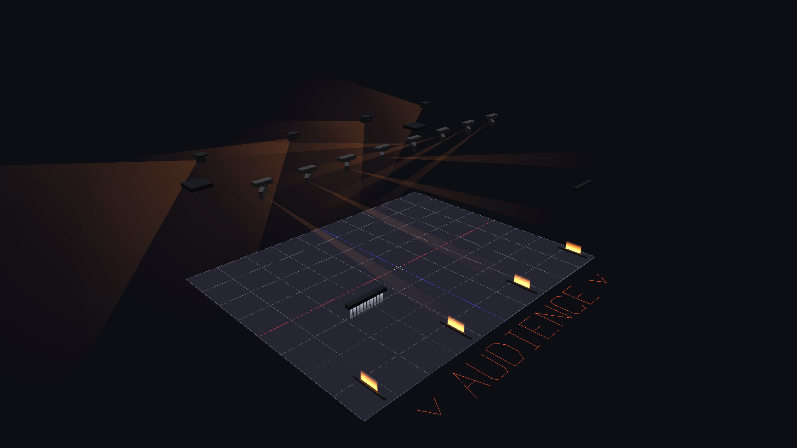
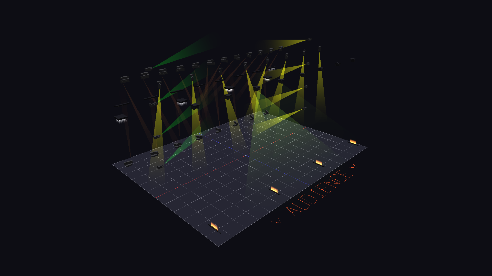
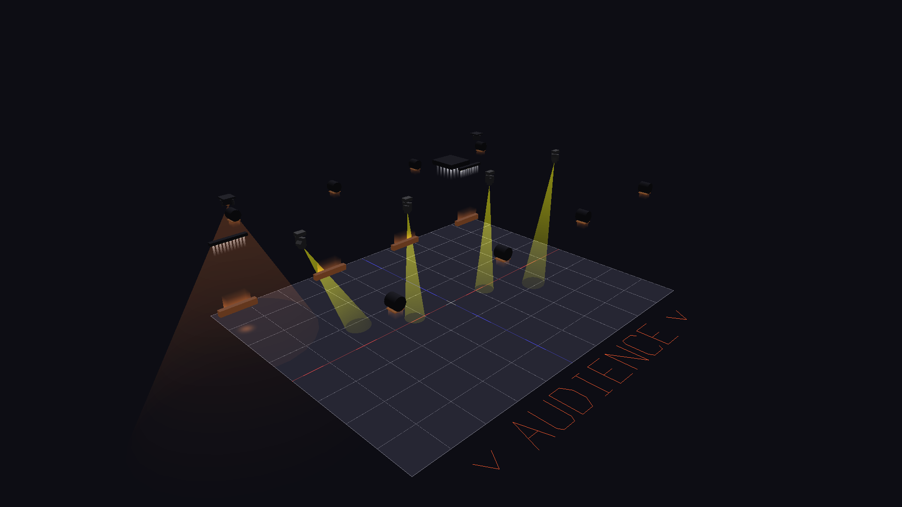

# QLC+ Show Creator

A visual show authoring tool for [QLC+](https://www.qlcplus.org/) - timeline-based effect editing, audio synchronization, real-time ArtNet preview, a 3D Visualizer, and an experimental live audio-reactive engine. Exports to `.qxw` workspace files that run on the night in QLC+ itself.

> **Status:** `v1.0.0` — the first community release. See the [CHANGELOG](CHANGELOG.md) and [ROADMAP](ROADMAP.md).

---

## What it does

- **Builds shows visually** - drag fixtures into stage positions, define song structure (BPM, time signature, parts), then paint effects onto a beat-aligned timeline.
- **Previews live** - built-in 3D visualizer + ArtNet output at 44 Hz, so you can iterate without lighting an actual stage.
- **Exports to QLC+** - generates a `.qxw` workspace with fixture mappings, sequences, virtual console, and master presets. Your show runs on QLC+ in production.
- **Generates shows from audio** - point it at an audio file + your song structure; it picks lighting rudiments per fixture group based on energy, vocal presence, and spectral contrast. Output is regular timeline blocks you can edit.
- **Runs unscripted (experimental)** - Auto Mode listens to live audio (mic / interface / loopback) and drives DMX in real time. For rehearsal jams, busking, or the parts of the set you haven't authored yet.

Full feature tour: [FEATURES.md](FEATURES.md). What's next: [ROADMAP.md](ROADMAP.md).

---

## Screenshots

A bundled demo show autogenerated on the festival-mainstage demo rig, rendered by the built-in 3D visualizer:


| DJ / EDM | Festival mainstage | Mid-size band |
|:---:|:---:|:---:|
|  |  |  |

*All of the above is reproducible from the bundled demo rigs and shows — see [`demos/`](demos/). Regenerate any of it with `python -m demos.generate_media <rig>`.*

---

## Install

### With conda (recommended)

```bash
conda env create -f environment.yml
conda activate QLCAutoShow
python main.py
```

### With pip

```bash
pip install -r requirements.txt
python main.py
```

### System requirements

- Python 3.12+
- Windows / Linux / macOS (developed primarily on Windows 10)
- A graphics driver with OpenGL 4.1+ for the 3D visualizer
- **Linux**: PortAudio for the audio features
  ```bash
  sudo apt-get install libportaudio2 portaudio19-dev   # Ubuntu/Debian
  sudo dnf install portaudio                           # Fedora
  ```
- **Optional**: ASIO drivers if you have a Focusrite / RME / similar interface - Auto Mode detects them automatically.

---

## Quick start

The five-minute path from blank project to a working show:

1. **Configuration** - add a universe and pick its output (E1.31, ArtNet, or USB DMX).
2. **Fixtures** - import the `.qxf` definitions for your rig from the QLC+ library (or `custom_fixtures/`) and group them by role (front PARs, rear washes, movers, …).
3. **Stage** - drag fixtures into position on the 2D plot. The right pane previews the rig in 3D with all channels at full so you can see what you're placing.
4. **Structure** - define the song: parts, BPM per part, time signature, bar counts, transitions.
5. **Shows** - drop riffs onto the timeline, or paint dimmer / colour / movement / special blocks lane by lane. Enable ArtNet output and / or the embedded visualizer to preview as you go.
6. **Export** - `File → Export QLC+ Workspace`. Open the `.qxw` in QLC+ and you're done.

### Unscripted (Auto Mode)

`Ctrl+L` opens the Auto Mode tab. Pick a host API + audio input, hit **START**, and the engine selects rudiments per group from a sliding window of live audio. FILL NOW, colour override, BPM tap, and per-group AUTO / CURATED / LOCKED controls are on the same tab.

### Auto-generate a prepared show

`Tools → Autogenerate Show` runs the full audio-analysis + rudiment-matching pipeline against your structure and produces editable timeline blocks. The Generation Inspector dialog shows why each pick was made.

---

## Project layout

```
QLCplusShowCreator/
├── main.py              # Entry point
├── config/              # Data models + YAML serialization
├── gui/                 # Tabs, dialogs, stage view, themes
├── timeline/            # Playback engine + song structure
├── timeline_ui/         # Timeline widgets + effect editors
├── effects/             # 15 intensity + 11 movement effects
├── rudiments/           # Atomic light-pattern vocabulary used by autogen + Auto Mode
├── riffs/               # Reusable effect library (builds, drops, fills, loops, movement, custom)
├── audio/               # Playback + live capture + real-time spectral analysis
├── auto/                # Auto Mode engine, BPM, DMX, widgets
├── autogen/             # Algorithmic show-generation pipeline
├── utils/               # ArtNet, TCP, .qxf parsing, orientation, .qxw export
├── visualizer/          # 3D Visualizer (composable renderer)
├── custom_fixtures/     # Your fixture definitions (.qxf)
├── shows/               # Show data (CSV + audio)
├── tests/               # Unit + visual regression
└── docs/                # Architecture, subsystem docs, gotchas
```

---

## Documentation

User-facing:
- [FEATURES](FEATURES.md) - full capability tour
- [ROADMAP](ROADMAP.md) - themed milestones (v1.1 stage layers and rig import/export, v1.2 authoring polish, v1.3 stability and error reporting, v1.4a stage-relative movement, v1.4b show morphing, v1.5 timeline ergonomics, v1.6 Live tab and MIDI clock sync, v1.7 autogen polish, v1.8 Auto Mode hardening, v1.9 visualizer breadth, v2.0 algorithmic generation v2)
- [CHANGELOG](CHANGELOG.md) - what shipped when

Subsystem:
- [Architecture](docs/architecture.md) - directory structure, data models, communication
- [ArtNet DMX Output](docs/artnet.md) - real-time DMX preview
- [TCP Protocol](docs/tcp-protocol.md) - visualizer config sync
- [3D Visualizer](docs/visualizer.md) - rendering, effects, camera
- [Fixture Orientation](docs/orientation.md) - 3D orientation + mounting
- [Fixture Taxonomy](docs/fixture_taxonomy.md) - QLC+ fixture survey + composable-renderer design
- [Riff System](docs/riffs.md)
- [Metric Analysis](docs/metric_analysis_results.md) - empirical audio metrics behind autogen v3

For contributors:
- [Qt Gotchas](docs/qt-gotchas.md) - PyQt6 / QSS pitfalls
- [GL Gotchas](docs/gl-gotchas.md) - ModernGL / OpenGL surprises

---

## Compatibility

- **QLC+** - workspace export targets recent QLC+ Plus builds. Reference workspace shipped at `workspace_qlc_reference.qxw`.
- **ArtNet universe numbering is 0-based** (changed in v0.9.5 to match the wire protocol).
- **Fixture definitions** - any `.qxf` from the upstream QLC+ fixture library works. Detection of moving wash without gobo, moving-cell bar, and pixel matrix archetypes is part of the v1.0 fixture rewrite - see [CHANGELOG](CHANGELOG.md#fixture-rewrite-capabilities-based-renderer).

---

## Contributing

The project is GPL-3.0 and developed in the open. Issues and pull requests welcome - the [ROADMAP](ROADMAP.md) groups the working backlog into themed milestones, with deeper theory notes in `docs/` (`autofuture.md`, `theory-algorithmic-show-generation.md`). Pick anything that's not in flight.

If you find a fixture in the QLC+ library that renders incorrectly, please open an issue with the `.qxf` attached - the composable renderer is validated by a visual-regression harness (`tests/visual/`) and adding new archetypes is the most useful contribution path.

---

## License

GPL-3.0 - see [LICENSE](LICENSE).
